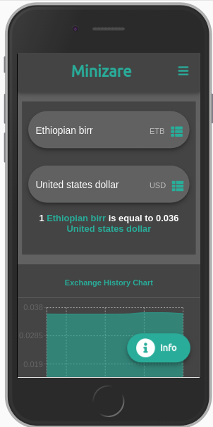

# Minizare
[Web Site](https://abdulhamidoumer.github.io/Minizare/).



Minizare is an open source currency conveter web app powered by the free currency converter API. currently Minizare supports about 156 currencies and 201 countries internationally.

## Contributions
Any kind of contributions and bug fixes to the Minizare code base is always welcome. Read the instructions below and fix any kind of bugs that are disturbing you, to make code improvments or to add any new features you want.

    1. Fork Minizare and clone to your machine if you prefer to do that.
    2. Minizare is built using react so make sure your development machine have Node.js installed. After that install all the dependencies inside the directory using the ```npm``` install command.
    3. If you want to add new features make sure to branch from the 'develop' branch.
    4. Don't do your works on 'gh-pages' branch as it is a production build, no changes will be merged.
    5. Do all your works and test your works.
    6. Write a good commit messages to every new things you have changed or made.
    7. Push to your origin repository and create a new pull request.

    If you want more guide on contributing for opensource projects read this 


